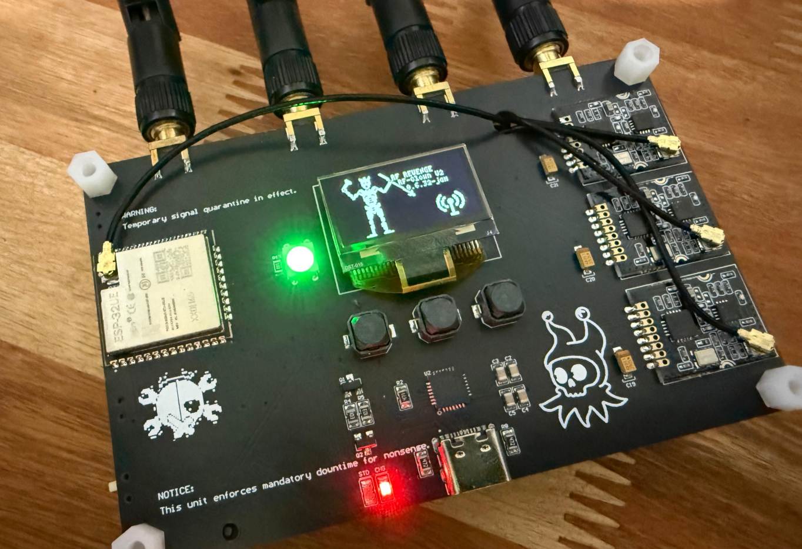

# RF Revenge for RF-Clown


RF Revenge is independent firmware for the ESP32-based RF-Clown V2 device. It supports an SSD1306-class OLED, status LED, three buttons, and up to three nRF24 radios.

## Origin and hardware credit

I bought an RF-Clown 2.0 to explore RF gadgets. I considered the hardware good and wanted different firmware for my personal requirements, so I wrote this firmware from scratch for the documented device. I used original project material only as a hardware and pinout reference. After my own testing, I decided to share this work with the community.

Thank you to [CiferTech and the RF-Clown project](https://github.com/cifertech/RF-Clown) for documenting the hardware. RF Revenge is an independent firmware project, not a statement about the quality of the original firmware. The projects document different user-facing choices: RF-Clown documents its BLE/Bluetooth-oriented hardware project, Arduino and precompiled-binary flashing flow, and mode-indicating LED; RF Revenge documents a PlatformIO build, host checks, explicit-port flashing, diagnostics, NVS-backed settings, passive Wi-Fi proximity, management-frame test controls, 2.4 GHz JAM controls, and bounded safety controls.



## Current capabilities

- **2.4G Wi-Fi Proximity:** Passively discovers visible Wi-Fi networks. You can lock the selected BSSID; the display uses exponentially smoothed RSSI, a 15-bar indicator, and a rising, falling, or stable trend. This is a proximity-oriented display, not a distance measurement or proof of identity.
- **Wi-Fi De-Auth:** A compile-enabled Wi-Fi management-frame test control in the current build. It obtains selection data from a Wi-Fi scan, displays the channel and BSSID, requires a local warning and countdown, and offers a 30-second to 5-minute session. Holding Select cancels or stops it. It does not promise a client-disconnect outcome.
- **2.4G Jam:** A compile-enabled control named `2.4 GHz JAM` in the interface. Up to three nRF24 radios can operate through this path. It requires local warning and countdown, has a selected 30-second to 5-minute session, and stops on a Select hold. A watchdog cuts carrier/radio control when the main-loop heartbeat is stale; starting is blocked when that watchdog is unavailable. No physical RF effect is claimed.
- **GFSK MAP & KILL:** A MAP profile that first asks for a band, then runs a mapping window with radio A scanning and radios B and C off. It samples nRF24 RPD activity; for the Wi-Fi band, it also passively seeds the histogram from an ESP32 Wi-Fi scan because RPD does not latch OFDM. The UI shows the map, histogram, and diagnostic status, then selects a bounded subset of channels above a noise floor. Only after mapping can the normal JAM session transition occur, still subject to its local arm and safety controls. I found this channel-selection workflow personally useful and surprising in controlled testing; this is not a claim of performance against devices, protocols, or conditions on air.
- **Diagnostics:** Reports OLED, I2C, status LED, and detected nRF24 health. Safe boot powers down external radios.
- **Settings:** Persists LED enabled state, LED brightness, and TX-power selection in ESP32 NVS. The interface can signal an error if saving does not succeed.

The main menu contains `2.4G Wi-Fi Proximity`, `Wi-Fi De-Auth`, `2.4G Jam`, `Settings`, `About`, and `Diagnostics`. The De-Auth and Jam entries are compile-gated and enabled in the current documented build.

## Build and flash

From the repository root, run the standard setup, guarded-patch, build, and host-check path:

```sh
./tools/setup.sh
```

The script prepares dependencies, validates and applies the guarded local patch when needed, builds the firmware, and runs host checks. It does not flash a device by default.

Flashing is explicit. Verify the device port yourself, then pass that exact port:

```sh
./tools/setup.sh --flash /dev/ttyUSB0
```

## Safety and limits

Operate only where you have established permission for the equipment, spectrum, site, and activity. Keep any transmission-related testing isolated from third-party equipment and shared spectrum, use the visible arm/countdown and bounded session controls, and use Select hold to cancel or stop an active session. A successful setup, patch, build, host check, or flash does not prove RF behavior, permission, compatibility with other dependency versions, or suitability in every environment.

## Documentation

- [User manual](docs/USER_MANUAL.md)
- [Patch reproduction](docs/PATCH_REPRODUCTION.md)
- [MIT License](LICENSE)
